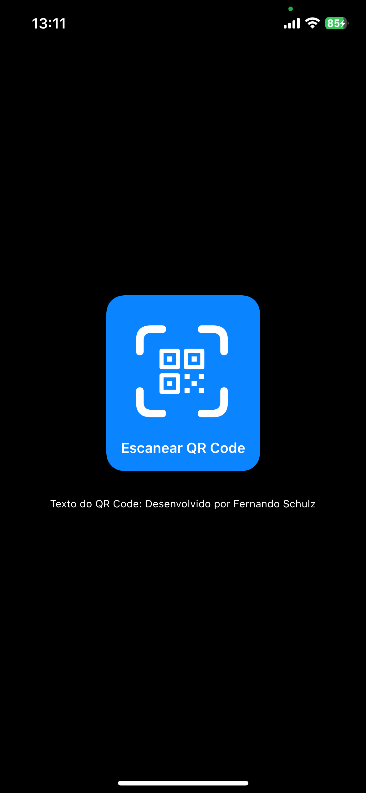

# 📝 Leitor QR Code SwiftUI / MVVM

Projeto de um **app Leitor QR Code** utilizando a arquitetura **MVVM**, interfaces implementadas com **SwiftUI**. Este projeto inclui:

✨ **Principais Funcionalidades**:
- Utilização da biblioteca AVFoundation para manipulação da câmera;
- Arquitetura **MVVM** para separação de responsabilidades;
- Implementação de interfaces com **SwiftUI**;
- Utilização de **protocols** para persistências;
- Leitura de QR Codes;
- QR Codes URL abrem diretamente no navegador do dispositivo;
- O valor das leituras dos QR Codes são disponibilizadas na tela principal logo abaixo do botão para a leitura para conferência do valor que o QR Code possui;

## 🛠 Requisitos
- **macOS** 11 ou superior
- **Xcode** 12 ou superior
- **Swift** 5.3 ou superior

## 📦 Dependências Externas
Este projeto **não possui dependências externas**. Basta rodar o projeto diretamente para utilizá-lo. Necessário rodar em um dispositivo físico, pois emulador não possui acesso a câmera.

## 📸 Imagens

  
  

## 🚀 Como Rodar o Projeto
1. Abra o projeto no **Xcode**.
2. Selecione um simulador ou dispositivo real.
3. Execute o app clicando no botão **Run** ou usando o atalho `Cmd + R`.

## 📄 Licença

Copyright (c) 2025 Fernando Schulz

Permission is hereby granted, free of charge, to any person obtaining a copy of this software and associated documentation files (the "Software"), to deal in the Software without restriction, including without limitation the rights to use, copy, modify, merge, publish, distribute, sublicense, and/or sell copies of the Software, and to permit persons to whom the Software is furnished to do so, subject to the following conditions:

The above copyright notice and this permission notice shall be included in all copies or substantial portions of the Software.

THE SOFTWARE IS PROVIDED "AS IS", WITHOUT WARRANTY OF ANY KIND, EXPRESS OR IMPLIED, INCLUDING BUT NOT LIMITED TO THE WARRANTIES OF MERCHANTABILITY, FITNESS FOR A PARTICULAR PURPOSE AND NONINFRINGEMENT. IN NO EVENT SHALL THE AUTHORS OR COPYRIGHT HOLDERS BE LIABLE FOR ANY CLAIM, DAMAGES OR OTHER LIABILITY, WHETHER IN AN ACTION OF CONTRACT, TORT OR OTHERWISE, ARISING FROM, OUT OF OR IN CONNECTION WITH THE SOFTWARE OR THE USE OR OTHER DEALINGS IN THE SOFTWARE.
